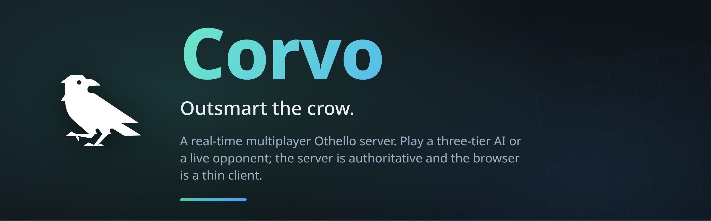
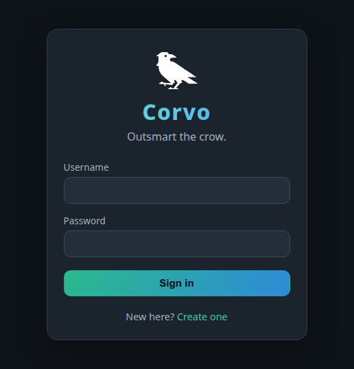
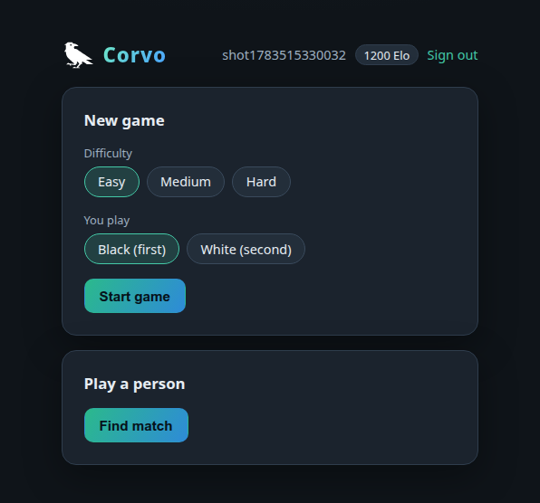
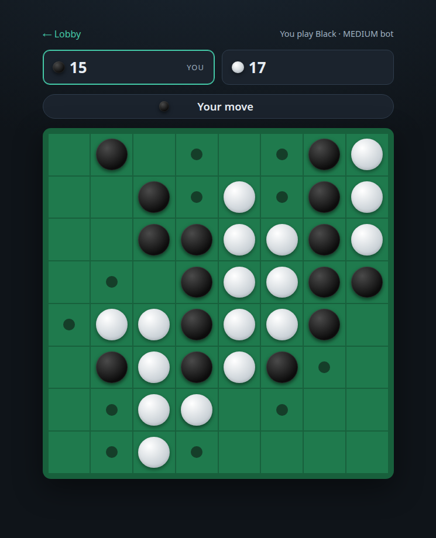
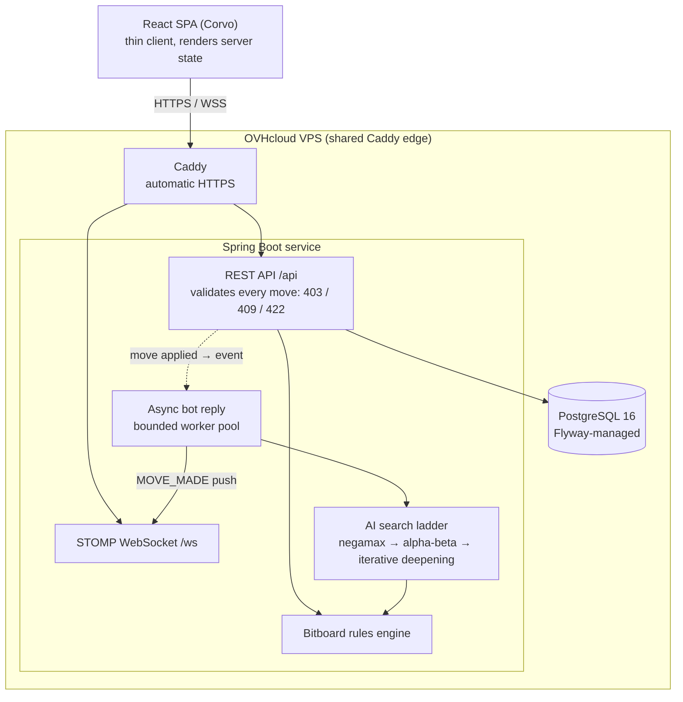

<p align="center">
  
</p>

<p align="center">
  <a href="https://corvo.kplanky.dev"></a>
  
  
  
  
</p>

# Corvo: an Othello game server

A real-time multiplayer Othello (Reversi) server. You can play a three-tier AI or a live opponent
over the web. The server is authoritative: it owns every rule, validates every move, and the
browser is a thin client that only renders the state the server sends back.

The app is live at **[corvo.kplanky.dev](https://corvo.kplanky.dev)**. "Corvo" is the front-end
brand, a crow that you are invited to outsmart.

## Screenshots

<table>
  <tr>
    <td width="33%"></td>
    <td width="33%"></td>
    <td width="33%"></td>
  </tr>
  <tr>
    <td align="center"><sub>Sign in or register</sub></td>
    <td align="center"><sub>Lobby: start a game or find a match</sub></td>
    <td align="center"><sub>In play, with legal-move hints</sub></td>
  </tr>
</table>

The board renders straight from the server's state string. Legal squares light up, placed discs
pop in, and captured discs flip in a cascade outward from the move. None of that logic runs in the
browser. The client asks the server what is legal and what changed.

## Features

Play against the AI on three difficulty tiers, each written as a distinct opponent rather than the
same engine on a timer. Games against the AI are unrated practice.

Play a live opponent through matchmaking. Joining the queue pairs you with the next waiting player,
assigns colours, and drops you both into the same game. Human-vs-human games are rated.

Each player in a live match has a five-minute time bank. The clock is server-authoritative: the
mover is charged the time they actually spend, and a background sweep forfeits anyone whose bank
reaches zero on their turn. If a player disconnects, their opponent is told, a 30-second grace
timer starts, and the game is forfeited only if they do not reconnect in time.

Rated results move an Elo rating (K-factor 32) and are written to a per-user rating history. The
leaderboard ranks players using PostgreSQL window functions, and each player has a stats view with
their record and rating over time.

In-progress games persist server-side in Postgres, so a refresh drops you back onto the same board.
The lobby lists your resumable games, and you can discard a single-player game you no longer want.

## Architecture

The application is served same-origin. Caddy terminates TLS and reverse-proxies to the Spring Boot
service, which serves the bundled React SPA, the REST API under `/api`, and the STOMP WebSocket
endpoint at `/ws` from one jar. State lives in PostgreSQL, and Flyway applies schema migrations on
startup.



The server being authoritative is the anti-cheat. The client never decides whether a move is
legal. Every move submission is checked for three things, each mapped to its own HTTP status: are
you a participant (`403` if not), is it your turn (`409` if not), and is the move legal (`422` if
not). Concurrent submissions for the same game collide on an optimistic-lock version and a unique
index on `(game_id, move_number)`, so a race resolves to one accepted move and one `409` rather
than a corrupt board.

## The rules engine and AI

The board is two 64-bit bitboards, one for each colour, with one bit per square. Legal moves,
disc flips, and the pass rule are computed with directional bit shifts, masked at the a- and h-files
so a shift can't wrap around the edge. A player passes only when they have no legal placement, and
the game ends on a double pass or a full board. Both are tested directly, since they are the easy
things to get wrong.

The AI is a game-agnostic search interface with several implementations, laddered from a
full-width negamax (the correctness reference) up to iterative deepening. The three difficulty
tiers map onto this ladder as different playing characters:

| Tier | Displayed rating | How it plays |
|---|---|---|
| Easy | 1000 | Greedy one-ply search that grabs the most flips, with a 30% chance of a random move |
| Medium | 1500 | Alpha-beta to depth 3 over a phase-aware evaluator, with a 10% chance of a blunder |
| Hard | 1800 | Iterative deepening to depth 5 within roughly a 1.2s budget; plays deterministically |

The evaluator weighs corner control, penalises squares next to an empty corner, and shifts from
valuing mobility in the opening to valuing raw disc count toward the end of the game.

The AI never blocks the HTTP request. When you submit a move against the AI, the server applies
your move, commits, and returns immediately. The reply is computed off-thread on a small bounded
worker pool after the transaction commits, then pushed to you over the WebSocket as a `MOVE_MADE`
event. A slow search can't hold your request open.

## Tech stack

| Area | Technology |
|---|---|
| Backend | Java 21, Spring Boot 4.1 (MVC, Data JPA / Hibernate, Security, WebSocket), Maven |
| Auth | Stateless JWT (jjwt 0.12.6, HS256), BCrypt password hashing |
| Database | PostgreSQL 16, Flyway migrations |
| Real-time | STOMP over WebSocket |
| Front end | React 19, TypeScript 5.7, Vite 6, `@stomp/stompjs` |
| Tests | JUnit 5, Testcontainers (real Postgres), Vitest + React Testing Library |
| Delivery | Docker multi-stage build, GitHub Actions, Semgrep, Trivy, Caddy, GHCR |

## Getting started

You need a JDK 21, Node.js 20 or newer, and Docker (for the local Postgres and the test suite).

Bring up the database and the backend:

```bash
# 1. Start the local Postgres
docker compose up -d

# 2. Provide config: copy the template and set a real JWT secret
cp .env.example .env
# edit .env: set JWT_SECRET to at least 32 bytes, e.g. `openssl rand -base64 48`

# 3. Export the env and run the server (serves on :8080)
set -a; . ./.env; set +a
./mvnw spring-boot:run
```

In a second terminal, run the front-end dev server:

```bash
npm --prefix frontend install
npm --prefix frontend run dev   # http://localhost:5173
```

The Vite dev server proxies `/api`, `/ws`, and `/health` to the backend on `:8080`, so there is no
cross-origin setup in development. In production the SPA is bundled into the server's jar and
served from the same origin, so no proxy or CORS configuration ships.

## Testing

The suite has roughly 200 backend tests across about fifty classes, plus a front-end Vitest suite.
They fall into two kinds: pure unit tests with no database (the rules engine, the AI search, and
the Elo maths) and integration tests that run against a real PostgreSQL spun up by Testcontainers
(persistence, auth, the REST API, and the WebSocket flows). The rules engine is covered directly
for the parts that are easy to break: flips in all eight directions, edge masking, the forced-pass
and illegal-pass cases, and the double-pass and board-full endings. The AI tests assert that
alpha-beta returns the same move as negamax while visiting strictly fewer nodes.

```bash
./mvnw verify                                   # full backend build + tests (starts Testcontainers)
./mvnw test -Dtest=OthelloRulesLegalMovesTest   # one class
npm --prefix frontend test                      # front-end tests
```

The build carries no secrets: the tests inject a throwaway `JWT_SECRET`, and a test fails the build
if any secret literal appears in the source.

## CI/CD and deployment

Every push and pull request runs the CI workflow, which has three jobs in parallel: the Maven build
and test run, a Semgrep static-analysis scan that fails on any error-severity finding, and a Trivy
scan of both the dependencies and the built container image that fails on a fixable critical or
high CVE. The scan reports are saved as build artifacts.

A push to `main` that passes CI triggers the deploy workflow. It builds the production image, pushes
it to the GitHub Container Registry tagged with the commit SHA and `latest`, then connects to the
OVHcloud VPS over SSH and runs `docker compose pull && up -d`. Because Flyway applies migrations
on startup, a deploy also applies any new schema changes. Caddy issues and renews the TLS
certificate automatically, and the app port is never published to the host; only Caddy is.

The image itself is a three-stage Docker build: one stage builds the SPA with Node, one builds the
bootable jar with a JDK and bundles the SPA into it, and the runtime stage is a slim non-root JRE
image.

## API

All endpoints are under a bearer JWT unless marked public.

| Method | Path | Notes |
|---|---|---|
| POST | `/api/auth/register` | Public. Creates an account, returns a token |
| POST | `/api/auth/login` | Public |
| GET | `/api/auth/me` | The current user |
| POST | `/api/games` | Create a vs-AI game (`difficulty`, `botSide`) |
| GET | `/api/games/{id}` | Game state, oriented for the caller |
| GET | `/api/games/{id}/moves` | Move history |
| POST | `/api/games/{id}/moves` | Submit a move (`position` 0-63, or `pass`) |
| GET | `/api/games?status=` | The caller's games, optionally filtered by status |
| DELETE | `/api/games/{id}` | Discard an own in-progress single-player game |
| POST | `/api/matchmaking/queue` | Join the PvP queue |
| DELETE | `/api/matchmaking/queue` | Leave the queue |
| GET | `/api/leaderboard` | Public |
| GET | `/api/users/{id}/stats` | Public. Record and rating history |
| GET | `/health` | Public liveness check |

Real-time updates arrive over the STOMP WebSocket at `/ws`. The JWT travels in the CONNECT frame,
and a client can only subscribe to a game it is a participant in. Each message carries the full
game state oriented for the recipient.

| Destination | Events |
|---|---|
| `/topic/games/{id}` | `MOVE_MADE`, `GAME_OVER`, `OPPONENT_DISCONNECTED`, `OPPONENT_RECONNECTED` |
| `/user/queue/notifications` | `YOUR_TURN`, `MATCH_FOUND` |

## Security

Authentication is a stateless HS256 JWT with a 24-hour lifetime. The signing key comes from the
`JWT_SECRET` environment variable and has no in-source default, so an unset or too-short key fails
the server at startup instead of running insecurely. Passwords are hashed with BCrypt, and login
does the same work whether or not the username exists, so a caller can't tell registered usernames
apart by timing. WebSocket subscriptions are authorised per game, so one player cannot listen in on
another's match.

## Project layout

```
src/main/java/dev/kplanky/othello/
  auth/          registration, login, JWT filter and service
  config/        security, async executor, typed config properties
  domain/        JPA entities (User, Game, Move, RatingHistory) and enums
  engine/        game-agnostic search ladder
    othello/     bitboards, rules, evaluator, move ordering
  game/          game orchestration, bot reply, PvP push, turn clocks, disconnect policy
  matchmaking/   the PvP queue
  rating/        Elo maths
  leaderboard/   window-function leaderboard
  user/          user stats
  repository/    Spring Data repositories
  ws/            WebSocket config, STOMP auth, presence tracking
  web/           health, exception handling
frontend/src/
  App.tsx        the auth → lobby → game state machine
  Auth.tsx  Lobby.tsx  GameView.tsx  Board.tsx
  api.ts         REST client       ws.ts   STOMP client       types.ts
```

## About

Built by [kplanky](https://corvo.kplanky.dev). Released under the MIT License, see [LICENSE](LICENSE).
